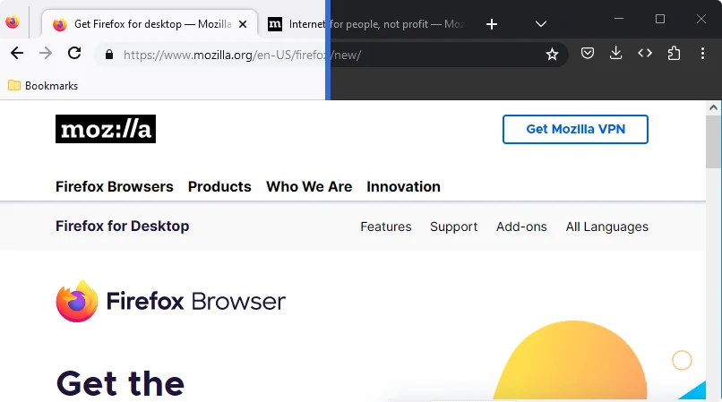

# MaterialFox

_A Material Design-inspired userChrome.css theme for Firefox_

## What this does

Inspired by Google's Material Design and their latest Google Chrome UI, this theme turns your Firefox into a Material-styled web browser. The aim was to style the browser as closely as possible to Google Chrome, where practical.

This is a userChrome.css theme, which means you must manually add it to your Firefox profile. The theme overrides certain browser styles. Currently, only the main UI is affected (settings pages, etc. are not). More elements of the UI may be styled in the future but a broader scope becomes harder to maintain as Mozilla updates their browser code so some UI styles may be culled or redone if they become unmaintainable.

## Installation

1. This theme depends on [uc.css.js](https://github.com/aminomancer/uc.css.js) and [fx-autoconfig](https://github.com/MrOtherGuy/fx-autoconfig) in order to use the `part` selector in author stylesheets. Please follow their installation instructions ([here](https://github.com/MrOtherGuy/fx-autoconfig#setting-up-configjs-from-program-folder)) first.
1. Copy the chrome folder and user.js file into your Firefox profile directory. To find your profile directory, go to about:support or about:profiles.
1. See [Recommended settings](#recommended-settings) if you'd prefer a more Chrome-like experience.
1. Restart Firefox.

### Recommended settings

You might want to set the following preferences in `about:config`.
| Pref | Type | Value | Note |
| - | - | - | - |
| materialFox.maximizedNoTopPadding | Boolean | True | Remove the space above the tab bar when Firefox is maximized |
| browser.tabs.tabClipWidth | Number | 83 | Replicate Chrome's behaviour for clipped tabs (default is `140`) |
| browser.uidensity | Number | 1 | Enable compact density in "Customize toolbar ..." |
| security.insecure_connection_text.enabled | Boolean | True | Replicate Chrome's "Not Secure" text on HTTP |

## Development

This theme uses SCSS to generate the CSS files for Firefox.

### Install dependencies

`npm install`

### Compile SCSS to CSS

`npm run build[:watch]`

## Please note

- This is a fork of the original MaterialFox by muckSponge. I've made some changes to the theme to suit my own preferences and I will update this theme as long as I use it myself but I cannot guarantee that it will work with your setup. My configuration is

  - Windows, macOS
  - Dark theme
  - Compact density

  Despite that I am willing to make changes to suit other configurations if I find the time and I am open to pull requests that do so.

- Some custom themes (e.g. Firefox Color) may be incompatible.
